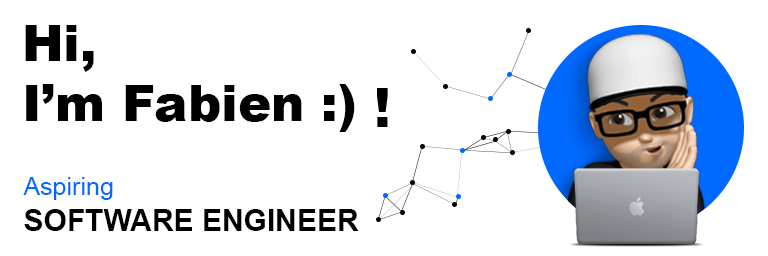

    <picture>
        <source media="(prefers-color-scheme: light)" srcset="./assets/images/banner-lightmode.webp">
        <source media="(prefers-color-scheme: dark)" srcset="./assets/images/banner-darkmode.webp">
        
    </picture>

## About me

As a new programming enthusiast, I'm eager to be part of a unique challenge!

My career path is far from conventional...

From my beginnings as a manager in fast food to managing customer service at SFR, then from my role as a technical expert at Apple to coordinating logistics operations at Tesla, I have consistently taken on new challenges and evolved in dynamic environments.

It's time for me to take a leap of faith and write a new chapter.
Becoming a software engineer 😉.

Thanks to [Holberton School](https://www.holbertonschool.com/), I have built a solid foundation during my first year of learning the fundamentals of development.

Now, I am specializing as a Full-Stack Developer until July 2026, while working at Holberton School as an educational manager in software development.

My unique path underlines my determination to push boundaries and explore new horizons.

Let's talk how I can bring my experience and passion to your projects!

## Tech stack

 

    
    
      

 

    
    
    

 

    
    
    
    
    
    
    
    
    
    
    
    
    
    

## Statistics

 

    
    

##

 

    

##

    
    
    

